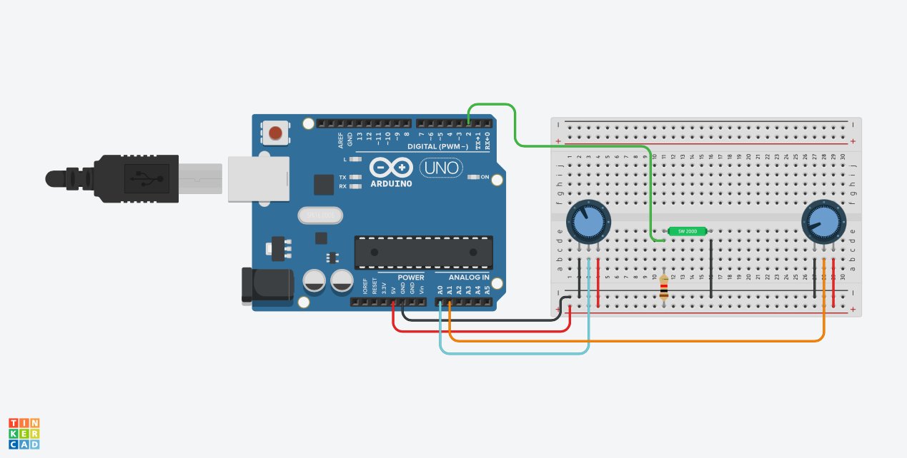

>## Table of content
>- [Introduction](#introduction)
>- [Requirements](#requirements)
>    - [Software](#software)
>    - [Hardware](#hardware)
>- [Setup](#setup)
>   - [Arduino](#arduino)
>       - [Wiring](#wiring)
>       - [Code](#code)
>   - [Dosbox setup](#dosbox-setup)
>       - [Windows](#windows)
>       - [Mac](#mac)
>   - [Enclosure](#enclosure)
>- [Playing](#playing)
>- [Further developing](#further-developing)
>- [Credits](#credits)

# Introduction 
I was sitting at my friend’s balcony after we'd exhausted every possible conversation, feeling bored yet comfortable; this feeling you years later realize was a sign of the good old days you know? suddenly my mind drifted to the upcoming assembly project. I’ve been thinking for days what I should do for it, then it hit me: We’ve all been there, fooling around with our friends in kindergarten living every day to its fullest. Then you notice there is some sort of gathering so you check it out, turns out one kid brought something that can be only described as a magical device which draws on a screen using two large knobs, one knob for vertical movement and the other for horizontal. This amusing device gained the attention of the whole class for the remaining of the day. "I should recreate this experience" I thought to myself. so I did. sort of.
# Requirements 
### Software 
- [Arduino ide](https://www.arduino.cc/en/software)  
- dos emulator (I'm using [dosbox](https://www.dosbox.com/download.php?main=1))  
### Hardware  
- arduino board  
- 2 potentiometers  
- tilt switch or pushbutton
- 10k resistor  
- some wires
# Setup
## Arduino  
### Wiring  
- connect leftmost leg on both potentiometers to `GND`
- connect rightmost leg on both potentiometers to `5V`
- connect the middle leg to `A0` and `A1`  
- - - - - - - - - - - - - - - - - - - 
- connect one leg of the tilt switch to `5V`  
- connect the other leg of the tiltswitch to `GND` through a 10k resistor

  
### Code  
upload `arduinoCom.ino` using the arduino ide
## Dosbox setup

In order to use serial communication with dosbox some settings have to be changed

### Windows 
In the dosbox config file (can be opened using the app called dosbox option) change `serial1` to the following: 

> `serial1=directserial realport:COM1`  

`COM1` should be replaced with your Arduino COM port which can be found using the Arduino ide

### Mac  
In the dosbox config file (usually found at ~/library/preferences) change `serial1` to the following:  

> `serial1=directserial realport:tty.usbmodem111`

`tty.usbmodem111` should be replaced with the name of your arduino device name which can be found using the arduino ide 
> **NOTE:** make sure to remove the /dev/ part from the device name
## Enclosure
You can just use a breadboard as your etch a sketch and in fact it's what I've done for the better part of a year. But before finally publishing this project I've decided it's only fitting to model an enclosure to it. You can find the stls and step files (in case you want to make adjustments) under the folder named 3d models.  
> **NOTE:** The enclosure is far from perfect yet im 90% satisfied with it so I've decided I won't make an improved version.  
The issues I have with it so far is first that it is a bit tight on the potentiometers and second that it is few mm too short to house standard jumper wires. Both of this problems proved themselves somewhat useful though in that the potentiometers don't need a nut to be kept still and also by having a reasonable comfortable height to grip.
# Playing
Just open dosbox mount it to a path as explained [here](https://www.dosbox.com/DOSBoxManual.html#START), run ETCH.exe and enjoy the nostalgic feeling of playing with an etch a sketch.
# Further developing
Coding in 16-bit 8086 is a fantastic experience, that said it can be a little tough sometimes. Along the way I made a bat file that helped me with running new code using one command instead of three. I've also gathered useful reading materials I've crossed upon along the way. Lastly I've included my Dosbox config file in which you just have to update a few lines with your own paths. All of those can be found under the folder named Tools. Hope I was of any help to any of you. Please go enjoy some great coding.
# Credits  
A huge thank you for my teacher for sparking lights of interest and joy in a place which could have been pretty dark.  
And a another notable thank you for my bud for printing the enclosure for me.